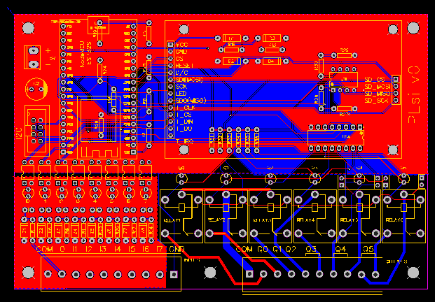
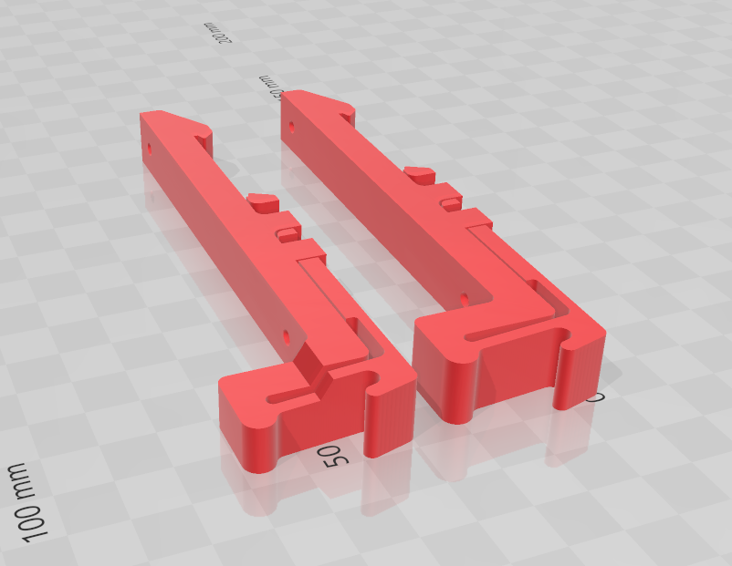

For each Hardware version, 2 folders are available:

+ board
+ housing

Please, check the readme.md file inside each folder to have more details.

------------------------------------------------------------------

## PLsi v0 board

------------------------------------------------------------------

## PLsi v0 housing

------------------------------------------------------------------

## PLsi v0 din rail mounting bracket

------------------------------------------------------------------
