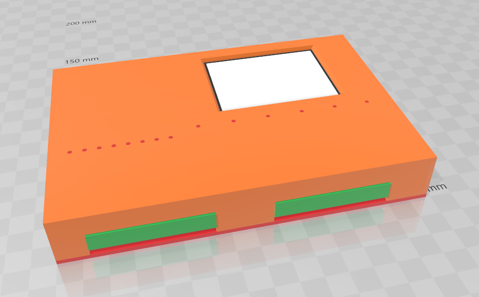

For each Hardware version, 2 folders are available:

+ board
+ housing

Please, check the readme.md file inside each folder to have more details.

# PLsi v0 board

# PLsi v0 housing

# PLsi v0 testing setup :)

