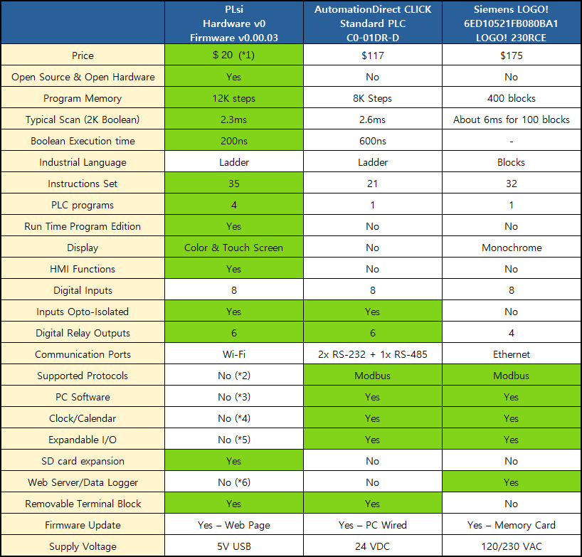
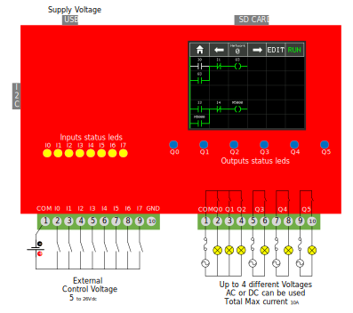
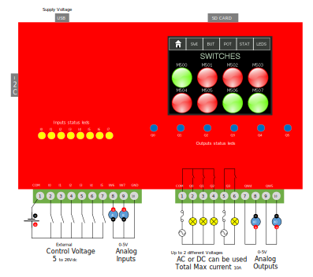
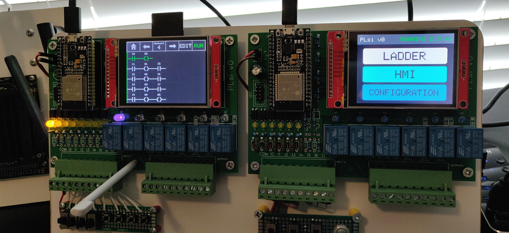
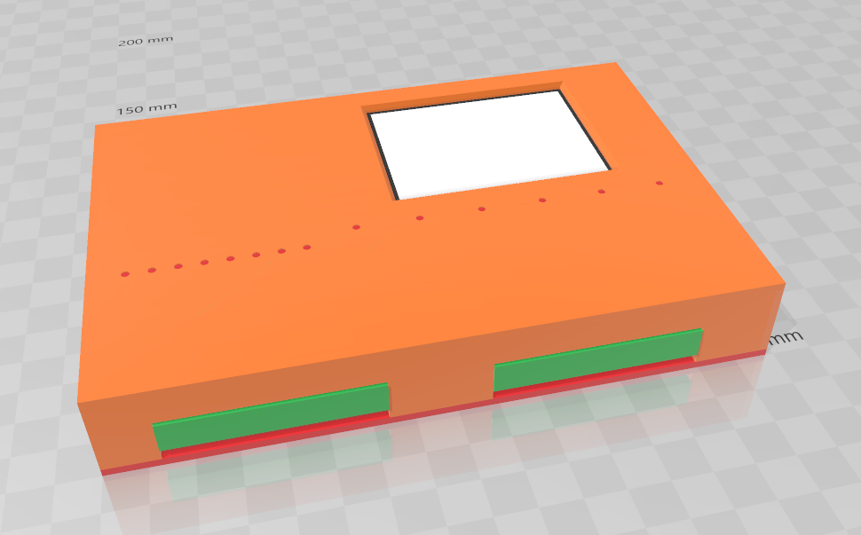
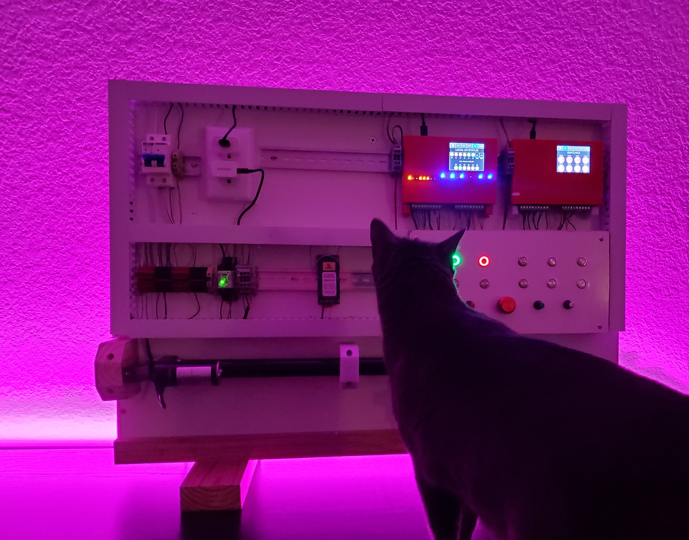

# **PLsi Project Objectives**

Create a PLC & HMI with the following main characteristics:
+ To not require external systems such us Laptops or Cellphones to be programmed
+ To be used on Classroom for educational purposes, IOT applications or industrial low risk applications
+ Software and Hardware with Industrial performance and features
+ Forever Open Source and Open Hardware
+ Focus on Low Cost, V0 hardware estimated in less than [$20](hard/v0-CPU/)

-----------------------------------------------------------------------------------------

## Hardware Version 0

**Main characteristics:**

- Easy to build, no SMD components. DIY!
- ESP32 Processor
	+ Dual Core @240MHZ
	+ Wi-Fi connectivity
- 2.8" 320x240 Touchscreen Display
- 8 Hardware Inputs 5-24VDC Isolated with status led
- 6 Hardware Relay Outputs with status led. Max 10A, external fuse required
- Different combinations of Digital and Analog I/O using the same board
	+ Analog I/O range: 0-5V 
- Removable Terminal blocks
- USB 5Vdc main power supply
- I2C port for hardwired expansions
- SD Card slot
- 3D printed housing model including DIN rail mounting bracket

-----------------------------------------------------------------------------------------

## Firmware Version 0.00.03

**Main functionalities:**

- PLC Ladder Logic Instruction set: 
	+ 35 instructions
	+ Boolean instructions full set
	+ Timers and Counters full set
	+ Comparisons full set
	+ 16 bit math functions
- PLC Memory Areas:
	+ 2000 Marks (M)
	+ 200 Counters (C) 
	+ 300 Timers (T)
	+ 10000 Registers 16bits (D)
- PLC Program size:
	+ Up to 400 networks of 6x5 cells (12K boolean instructions)
	+ Up to 4 PLC programs stored on internal memory (max. 400 networks each)
- PLC Program Editor
	+ Online Edition (with PLC running)
	+ Row, Column and Network Editor
	+ Network Navigation
- PLC performance and control
	+ Scan time of 2.3ms for 2000 Boolean instructions
	+ Processor Core 1 runs Ladder Logic exclusively
	+ RUN/STOP with user confirmation
- Display functions:
	+ PLC Programming and debugging
	+ PLsi Configuration
	+ HMI
		- "Fix" version implemented (User cannot edit memory areas nor texts)
		- Screen 1: 8 Switches M500 to M507
		- Screen 2: 8 Buttons  M510 to M517
		- Screen 3: 8 User Input Values D500 to D507 
		- Screen 4: Local I/O visualization
		- Screen 5: 8 Indicators M520 to M527
- Communications:
	+ Wi-Fi configuration. Only DHCP
	+ SSID scanning functionality
- Firmware update via Web Page
- Analog Inputs and Outputs
	+ Selectable via Configuration page

-----------------------------------------------------------------------------------------

## PLsi v0 Documentation

Build your own unit: [PLsi v0 Hardware Manual](./doc/PLsi_v0_Hardware_Manual.pdf)

Wiring, configuration and programming: [PLsi v0 User Manual](./doc/PLsi_v0_User_Manual.pdf)

 <!---
Or watch the Youtube videos: 
 + [Building a PLsi v0 - EN](https://www.youtube.com)
 + [Building a PLsi v0 - SP](https://www.youtube.com)
 + [Configuring and Programming a PLsi v0 - EN](https://www.youtube.com)
 + [Configuring and Programming a PLsi v0 - SP](https://www.youtube.com)
-->
-----------------------------------------------------------------------------------------

## PLsi v0 Comparison with similar products

 1. DIY components pricing is included [here](hard/v0-CPU/)
 	- This pricing considers to purchase some bulk quantities
 2. Two industrial protocols are planned to be added in future releases
 	- S7 connection [Issue #26](https://github.com/ElPercha/PLsi/issues/26)
	- Modbus TCP [Issue #27](https://github.com/ElPercha/PLsi/issues/27)
 3. Not planned yet
 4. To be included on Hardware V1 [Issue #35](https://github.com/ElPercha/PLsi/issues/35)
 5. The I2C expansion port is available to connect wired expansions
 	- Wi-Fi expansion modules are also feasible
	- Not in the roadmap yet
 6. A Web HMI hosted on the PLsi unit is proposed on [Issue #42](https://github.com/ElPercha/PLsi/issues/42)

-----------------------------------------------------------------------------------------

## PLsi v0 Wiring diagrams

The PLsi board v0 is designed to support, at least, 2 different configurations:
 1. All Digital I/O
 	- 8 Digital Inputs
	- 6 Digital Relay Outputs
 2. Digital and Analog I/O
 	- 6 Digital Inputs
	- 4 Digital Relay Outputs
 	- 2 Analog Inputs 0-5V
 	- 2 Analog Outputs 0-5V
 
Check the [drawing](./hard/v0-CPU/board/schematic/PLsi_v0_Schematic.pdf) and the [Hardware Manual](./doc/PLsi_v0_Hardware_Manual.pdf) for more details on how to build the 2 different models using the same [board](./hard/v0-CPU/board/pictures/PLsi_board.svg)

### PLsi v0 Digital wiring diagram 

+ Supply Voltage: 5V 1A (recommended 2A)
	- Standard Micro USB type B connector
+ External fuse or fuses are required to protect the Outputs circuits
	- Fuse size has to be calculated considering a total MAX consumtion of 10A
+ SD Card is optional, it has no functionality implemented in Fimware v0.00.03
+ I2C Port is optional, it has no functionality implemented in Fimware v0.00.03

### PLsi v0 Analog wiring diagram

+ Analog Inputs and Outputs are not isolated

-----------------------------------------------------------------------------------------

## PLsi v0 Testing setup 

## PLsi v0 Housing

## PLsi v0 Demo Panel

-----------------------------------------------------------------------------------------

Teach yourself and others how to program a PLC :)

-----------------------------------------------------------------------------------------
