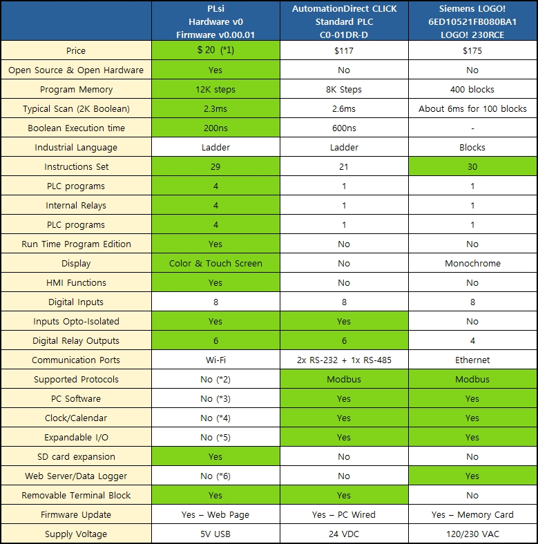
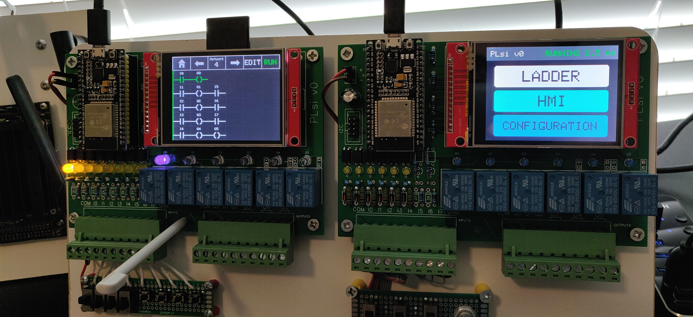
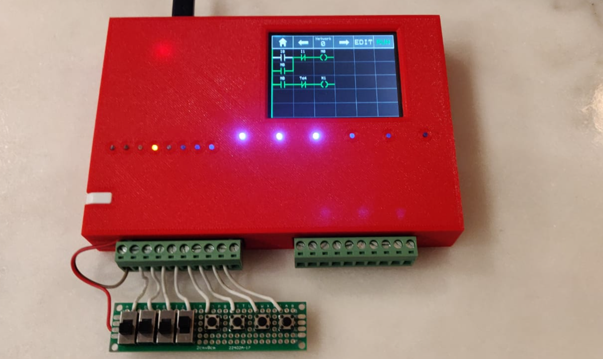

# **PLsi General Info**

+ Fully functional PLC & HMI based on ESP32 module and 320x240 Touchscreen Display  
+ Low Cost, estimated material cost less than USD 20 
+ Open Source and Open Hardware

Teach yourself and others how to program a PLC :)

-----------------------------------------------------------------------------------------

# Hardware Version 0

- ESP32 Processor
	+ Dual Core @240MHZ
	+ Core 1 runs Ladder Logic exclusively
	+ Wi-Fi connectivity
- 2.8" Display with Touch interface for:
	+ PLC Programming and debugging
	+ HMI Control
	+ Configuration
- 8 Hardware Inputs 5-24VDC Isolated with status led
- 6 Hardware Relay Outputs with status led. Max 10A, external fuse required
- Removable Terminal blocks
- USB 5Vdc main power supply
- I2C port for hardwired expansions
- SD Card slot
- 3D printed housing model including DIN rail mounting bracket

-----------------------------------------------------------------------------------------

# Firmware Version 0.00.01
Date: 5:30 PM 12/31/2020

**Main functionalities:**

- PLC Instruction set: 
	+ 29 instructions
	+ Boolean instructions full set
	+ Timers and Counters full set
	+ 16 bit math functions
- PLC Memory Areas:
	+ 2000 Marks (M)
	+ 200 Counters (C) 
	+ 300 Timers (T)
	+ 10000 Registers 16bits (D)
- PLC Program size:
	+ Up to 400 networks of 6x5 cells (12K boolean instructions)
	+ Up to 4 PLC programs stored on internal memory (max. 400 networks each)
- PLC Program Editor
	+ Online Edition (with PLC running)
	+ Row, Column and Network Editor
	+ Network Navigation
- PLC performance and control
	+ Scan time of 2.3ms for 2000 Boolean instructions
	+ RUN/STOP with user confirmation
- HMI functions:
	+ "Fix" version implemented (User cannot edit memory areas nor texts)
	+ Screen 1: 8 Switches M500 to M507
	+ Screen 2: 8 Buttons  M510 to M517
	+ Screen 3: 8 User Input Values D500 to D507 
	+ Screen 4: 8 Values status D510 to D517
	+ Screen 5: 8 Indicators M520 to M527
- Communications:
	+ Wi-Fi configuration. Only DHCP. 
	+ SSID scanning functionality
- Firmware update via Web Page

**Bug fixes:**

- None

-----------------------------------------------------------------------------------------

## PLsi v0 comparison with similar products

-----------------------------------------------------------------------------------------

## PLsi v0 testing setup 

## PLsi v0 housing

## PLsi v0 assembled unit

